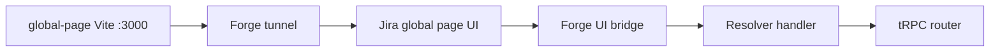

# forge-turborepo

Monorepo for an [Atlassian Forge](https://developer.atlassian.com/platform/forge/) Jira app with a **global page** UI: React (Vite) on the client, **tRPC** over the Forge UI bridge on the server. Managed with [Bun](https://bun.sh) workspaces and [Turborepo](https://turbo.build).

## Prerequisites

- [Node.js](https://nodejs.org/) 18 or newer
- [Bun](https://bun.sh) 1.3.11 (see `packageManager` in the root `package.json`)
- [Forge CLI](https://developer.atlassian.com/platform/forge/cli-reference/) and an Atlassian developer account for deploy and install

## Repository layout

| Area | Description |
| --- | --- |
| **Tooling** | Bun, Turborepo, TypeScript 5.9 |
| **`apps/main`** | Forge app: manifest, resolver, tRPC router (`nodejs24.x`). No `build` script; static UI is built elsewhere. |
| **`apps/global-page`** | Vite 8 + React 19 + Tailwind 4. Builds into `apps/main/build/global-page`. Dev server uses port **3000** to match the Forge tunnel in `manifest.yml`. |
| **`@repo/typescript-config`** | Shared `tsconfig` presets |
| **`@repo/tailwind-config`** | Shared Tailwind / Atlaskit-oriented CSS (`bun run generate:atlaskit-css` at the root regenerates token-related CSS) |
| **`@repo/trpc-react`** | tRPC React client, TanStack Query, and `@toolsplus/forge-trpc-link` for the UI |
| **`@repo/ui`** | Shared React UI package |

The server exposes tRPC via `@toolsplus/forge-trpc-adapter` with resolver function key **`trpc-forge-turborepo`**. The client in `@repo/trpc-react` must use the same key.

## Install

```sh
bun install
```

This repo’s `.gitignore` excludes `bun.lock`. Commit a lockfile if your team wants fully reproducible installs across machines.

## First-time setup

After `bun install`, run these from the repository root in order:

1. **`bun run forge:register`** — register a Forge app (updates `apps/main` for your account). Skip this if the app is already registered and [`manifest.yml`](apps/main/manifest.yml) is correct for your environment.
2. **`bun run build`** — build the global-page frontend into `apps/main/build/global-page`.
3. **`bun run forge:deploy`** — deploy the app to Forge.
4. **`bun run forge:install`** — install the app on your Atlassian site.

After that, use **`bun run dev`** for day-to-day development (tunnel + Vite).

## Development

From the repository root:

```sh
bun run dev
```

This runs `turbo run dev`, which starts **`forge tunnel`** in `apps/main` and the **Vite** dev server in `apps/global-page` (port 3000, aligned with `apps/main/manifest.yml` tunnel settings). Use this once the app is installed on a site (see [First-time setup](#first-time-setup)).

To run only the Forge tunnel:

```sh
bun run dev --filter=main
```

To run only the Vite app:

```sh
bun run dev --filter=global-page
```

## Build

```sh
bun run build
```

Only workspaces that define a `build` script run (currently **`global-page`**: `tsc -b && vite build`). Output is written to **`apps/main/build/global-page`**, which Forge serves as the global page resource.

Run `bun run build` before each deploy when the UI changes (see [First-time setup](#first-time-setup) for the full sequence).

## Forge deploy and install

From the root, these run Forge commands inside `apps/main`:

| Script | Command |
| --- | --- |
| `bun run forge:deploy` | `forge deploy` |
| `bun run forge:install` | `forge install` |
| `bun run forge:register` | `forge register` (new app registration) |
| `bun run forge:upgrade` | `forge install --upgrade` |

For a fresh clone, follow [First-time setup](#first-time-setup). After code changes, run `bun run build` then `bun run forge:deploy`; use `forge:install` when adding the app to a new site.

## Code quality

| Script | Purpose |
| --- | --- |
| `bun run lint` / `bun run lint:fix` | [oxlint](https://oxc.rs/docs/guide/usage/linter) with `oxlint.config.ts` |
| `bun run format` / `bun run format:fix` | [oxfmt](https://oxc.rs/docs/guide/usage/formatter) check or write |
| `bun run quality` / `bun run quality:fix` | Lint + format |

Git **pre-commit** (Husky) runs `bun run lint`.

## Architecture



The global page loads the bundled UI. Browser-side tRPC calls go through the Forge bridge to the resolver in `apps/main`, which executes the tRPC router (`apps/main/src/routers`).

## Extending the API

1. Add procedures to `apps/main/src/routers/index.ts` (and split into modules if needed).
2. Export `TrpcRouter` from that router; `packages/trpc-react/types/global.d.ts` maps it to the global `AppRouter` type used by the client. If you move the router file, update that import path.

Optional server-side Jira access uses `@narthia/jira-client` (see `apps/main/src/rest/jira-client.ts`).

## New apps and `manifest.yml`

`apps/main/manifest.yml` includes an `app.id` and permission scopes. For a **new** Forge app, run `bun run forge:register` as in [First-time setup](#first-time-setup), then ensure **`app.id`**, **scopes**, and **resources** match the product and site you target. Forks should replace the bundled app id with their own.

## Further reading

- [Forge documentation](https://developer.atlassian.com/platform/forge/)
- [Turborepo: running tasks and filters](https://turbo.build/docs/crafting-your-repository/running-tasks)
